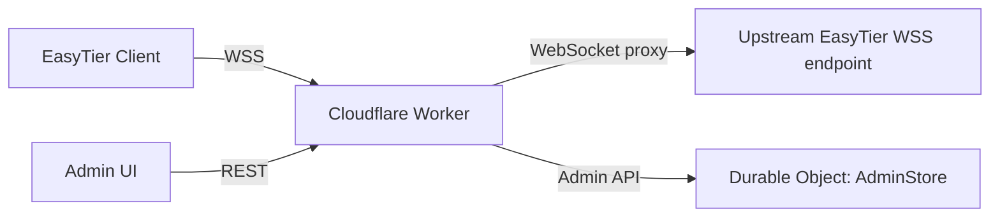

# EasyTier WSS CF

Cloudflare Workers 上的 EasyTier WSS 代理与管理后台。

## 这份代码做了什么

- 读取 EasyTier 上游实现后，确认 `wss` 在核心里本质上是“标准 WebSocket + 二进制隧道”。
- 也确认 EasyTier 的 web client 会把 `wss://.../<token>` 最后一个路径段当作 token 使用。
- 本项目不重写 EasyTier 核心，而是做一个边缘代理：
  - 前台提供 `wss://<your-domain>/ws/<route-id>/<client-token>` 入口
  - 后台提供管理界面和路由 CRUD
  - 每个路由都可以指向一个上游 `ws://` / `wss://` / `http://` / `https://` 端点

## 架构



## 主要能力

- 管理后台登录
- 路由新增、编辑、删除
- 路由公网入口自动生成
- 上游 WSS 连通性测试
- 连接数、总连接数、最近错误记录
- 透明转发 WebSocket 二进制帧

## 本地开发

1. 安装依赖
   - 只需要 Node.js
2. 启动开发环境

```bash
npx wrangler dev
```

3. 访问管理后台

```text
http://127.0.0.1:8787/panel
```

## 部署前准备

需要设置管理员密钥：

```bash
npx wrangler secret put ADMIN_SECRET
```

然后部署：

```bash
npx wrangler deploy
```

## EasyTier 侧使用方式

在 EasyTier 里把这个 Worker 当成一个共享 WSS 节点即可。管理后台会生成类似命令：

```bash
sudo easytier-core -d --network-name <name> --network-secret <secret> -p 'wss://your-domain/ws/<route-id>/<client-token>'
```

## 说明

- `wss://` 入口是给 EasyTier 客户端用的。
- Worker 转发上游时会把 `ws://` / `wss://` 自动转换成 `http://` / `https://` 进行 `fetch()`，符合 Cloudflare Workers 的 WebSocket 代理方式。
- 这是一个“代理与管理层”，不是 EasyTier 核心的替代实现。
